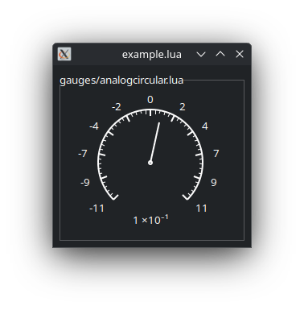
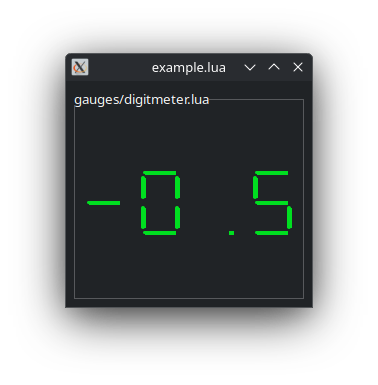
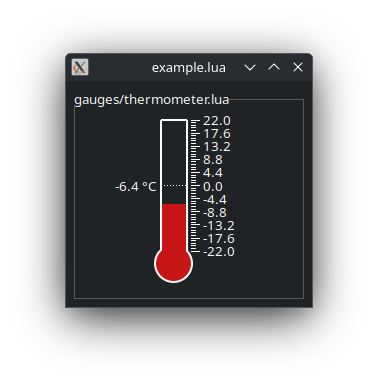
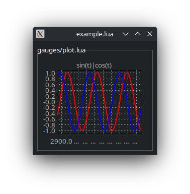

# Lua Drawing Gauges Library

This repository provides a small Lua library for drawing gauges, meters, plots, and thermometers on [IUP](http://webserver2.tecgraf.puc-rio.br/iup/) canvases.
It is intended for building graphical instrument panels, dashboards, or data visualization widgets in Lua.

## Features

- **Analog Circular Gauge** – classic dial with ticks, labels, and a needle.
  

- **Digit Meter** – seven-segment style digital display.
  

- **Thermometer** – vertical fluid tube with ticks, labels, and digital readout.
  

- **Plot** – scrolling live data graph with axes, ticks, labels, and title.
  

All components are configurable with parameters and masks to enable or disable parts of the rendering.

## Directory Structure

```
luagauges/
├── gauges/
│   ├── analogcircular.lua   # Analog circular gauge
│   ├── digitmeter.lua       # Seven-segment style meter
│   ├── thermometer.lua      # Thermometer widget
│   ├── plot.lua             # Live data plotting
│   └── gauges.lua           # Shared utilities
├── images/                  # Example images
│   ├── analogcircular.png
│   ├── digitmeter.png
│   ├── thermometer.png
│   └── plot.png
└── draw.lua                 # IUP Canvas Drawing API
```

## Usage

### 1. Creating a Canvas

You can create a canvas with a gauge attached using:

```lua
package.path = package.path .. ";luagauges/gauges/?.lua"

local iup = require("iuplua")
local gauges = require("gauges")

-- Create a canvas that draws a circular gauge
local cv = gauges.canvas(nil, "analogcircular", 0, 100, 42)
```

### 2. Drawing Gauges

Each widget has its own function inside the `gauges` table:

- **Analog Circular Gauge**
  ```lua
  gauges.analogcircular(canvas, min, max, current, flags)
  ```
  Draws a dial-like circular meter.

- **Digit Meter**
  ```lua
  gauges.digitmeter(canvas, value, flags)
  ```
  Renders a number or string in seven-segment style.

- **Thermometer**
  ```lua
  gauges.thermometer(canvas, min, max, current, flags)
  ```
  Displays a vertical thermometer with ticks, labels, and optional digital readout.

- **Plot**
  ```lua
  gauges.plot(canvas, id, flags)
  gauges.append(id, x, y) -- append new data point
  ```
  Scrollable live plot for time-series data.

### 3. Customization

Each gauge accepts an optional `flags` table, for example:

```lua
gauges.analogcircular(canvas, 0, 100, 75, {
  color = "0 128 255",
  width = 3,
  postfix = "%",
  cmajor = 10,
  cminor = 5,
  mask = { nodigital = true } -- disable digital display
})
```

### 4. Running the Demo

You can run `example.lua` to see all gauges in action.

```bash
lua draw.lua
```


## Requirements

- [Lua](https://www.lua.org/) 5.x
- [IUP Toolkit](http://webserver2.tecgraf.puc-rio.br/iup/) (`iuplua` module)

## License

MIT License. Feel free to use, modify, and distribute.
